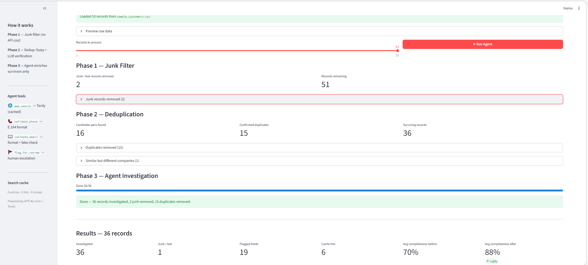

# MDM Agent

A real AI agent for B2B customer data quality — the agentic upgrade of [customer-mdm](https://github.com/Xiiiaowen/customer-mdm).

**[▶ Live Demo](https://mdm-agent-bmigye54nhlhrgmm9pkvlp.streamlit.app/)**



---

## From Pipeline to Agent

[customer-mdm](https://github.com/Xiiiaowen/customer-mdm) was built first as an LLM-enhanced ETL pipeline: a fixed sequence of clean → deduplicate → enrich → validate steps, each calling GPT-4o-mini as a function. It works well, but the control flow is entirely hardcoded in Python — the LLM never decides what to do next.

**MDM Agent** is the agentic successor. The LLM now drives the process: given a record and a set of tools, it decides what to investigate, which tools to call, whether to retry with a different query, and when to escalate to human review. No step is hardcoded.

| customer-mdm (pipeline) | mdm-agent (agent) |
|---|---|
| Fixed steps: clean → dedup → enrich → validate | LLM decides which steps are needed per record |
| Always calls Tavily search | Only searches when something is missing or suspicious |
| Can't retry with different approach | Retries with different queries if first search fails |
| No escalation path | Flags unresolvable fields for human review |
| Control flow is Python code | Control flow is the LLM's reasoning |

---

## How It Works

```
Upload
  ↓
Phase 1 — Junk filter       (heuristic, zero API cost)
           removes: "TEST ENTRY", "N/A", clearly fake records

Phase 2 — Deduplication     (fuzzy matching + LLM verification)
           translates non-ASCII names to English first
           removes: "3M" = "3M Company", "上海浦东发展银行" ≈ "Shanghai Pudong Development Bank"

Phase 3 — Agent investigation  (enriches surviving records only)
           Claude-style tool use loop: reason → call tool → observe → repeat
```

The order matters: enriching a duplicate or junk record wastes API calls. By filtering first, the agent only touches records worth processing.

---

## Features

- **3-phase pipeline** — junk filter → dedup → agent, in the right order
- **Autonomous investigation** — LLM decides which tools to call per record
- **GLEIF LEI registry** — authoritative legal entity lookup (official name, address, registration ID, jurisdiction) with no API key required; results cached to disk
- **Cross-language dedup** — Chinese/Japanese names translated to English before fuzzy matching
- **Web search with cache** — Tavily search results cached to disk; repeat runs cost less
- **Phone validation** — E.164 normalisation via `phonenumbers`
- **Email validation** — format check + fake domain detection
- **Human escalation** — agent flags fields it cannot resolve with a clear reason
- **Completeness scoring** — before/after % of key fields filled, per record
- **Reasoning trace** — see exactly what the agent thought and which tools it called
- **Multi-format upload** — CSV, Excel, JSON
- **Download results** — CSV and JSON export

---

## Project Structure

```
mdm-agent/
├── app.py                    # Streamlit UI (3-phase flow)
├── agent/
│   ├── __init__.py
│   ├── deduplicator.py       # Junk filter + fuzzy dedup + LLM pair verification
│   ├── investigator.py       # Agent loop (GPT-4o-mini tool use)
│   ├── tools.py              # Tool implementations (web_search, validate_phone, etc.)
│   ├── cache.py              # File-based web search cache
│   └── completeness.py       # Before/after completeness scoring
├── data/
│   └── sample_customers.csv
├── output/
├── photo/
│   └── mdm-agent-demo.png
├── .env
├── .env.example
├── requirements.txt
└── README.md
```

---

## Getting Started

### 1. Clone
```bash
git clone https://github.com/Xiiiaowen/mdm-agent.git
cd mdm-agent
```

### 2. Install
```bash
pip install -r requirements.txt
```

### 3. Set API keys
```bash
cp .env.example .env
# Edit .env and add your keys
```

You need:
- `OPENAI_API_KEY` — from [platform.openai.com](https://platform.openai.com)
- `TAVILY_API_KEY` — from [tavily.com](https://tavily.com) (free tier available)

### 4. Run
```bash
streamlit run app.py
```

---

## Agent Tools

| Tool | What it does |
|---|---|
| `gleif_lookup(company_name, country_code)` | GLEIF LEI registry — authoritative legal name, address, jurisdiction, registration ID (no API key needed) |
| `web_search(query)` | Tavily web search — cached to disk |
| `validate_phone(phone, country_code)` | E.164 normalisation |
| `validate_email(email)` | Format check + fake domain detection |
| `flag_for_review(field, reason)` | Human escalation for unresolvable fields |

---

## Tech Stack

| Layer | Library |
|---|---|
| Agent / LLM | OpenAI GPT-4o-mini |
| Legal Entity Data | GLEIF LEI Registry (free, no key) |
| Web Search | Tavily |
| Fuzzy Matching | rapidfuzz |
| Phone Validation | phonenumbers |
| UI | Streamlit |
| Data | pandas |

---

## What This Achieves

- **Real agentic behaviour**: the LLM decides what to investigate per record — not every record goes through the same steps
- **Cost-efficient design**: junk and duplicate records are removed before any enrichment API call is made; web search results are cached for repeat runs
- **Cross-language deduplication**: Chinese, Japanese, and other non-ASCII company names are translated to English before fuzzy matching, so "华为技术有限公司" and "Huawei Technologies" are correctly identified as the same company
- **Transparent reasoning**: every tool call and thought step is shown in the UI, making the agent's decisions auditable
- **Completeness tracking**: quantifies data quality improvement before and after, per record

---

## What Could Be Improved in Practice

**Deduplication accuracy**
The current approach translates names then fuzzy-matches. It still struggles with companies that use completely different names in different markets (e.g. a Chinese holding company vs its Western-market trading name). A production system would also cross-reference Companies House or other national registries beyond GLEIF.

**Cache expiration**
The web search cache has no expiry. Company information changes — phone numbers, addresses, websites. In production, cached entries should expire after 30–90 days and be refreshed.

**Address validation**
There is no structured address validation. The agent searches the web for address information but cannot verify it against a postal database. A production system would integrate an address validation API (e.g. Google Maps, HERE, SmartyStreets).

**Enrichment confidence by source**
The agent enriches fields from web search results without knowing how reliable the source is. A Wikipedia article and a random directory listing are treated equally. In practice, results should be ranked by source authority.

**Scale**
The O(n²) fuzzy matching in the dedup pre-pass is fine for datasets up to a few thousand records. For larger datasets, a blocking strategy (e.g. comparing only records with the same first character or country) would be needed to keep it practical.

**Human review loop**
Currently the agent flags unresolvable fields but the UI does not let users resolve them and re-run. A proper workflow would allow humans to fill in flagged fields and feed corrections back into the pipeline.

---

## Disclaimer

For learning and demonstration purposes. Not intended for production use without additional hardening.
